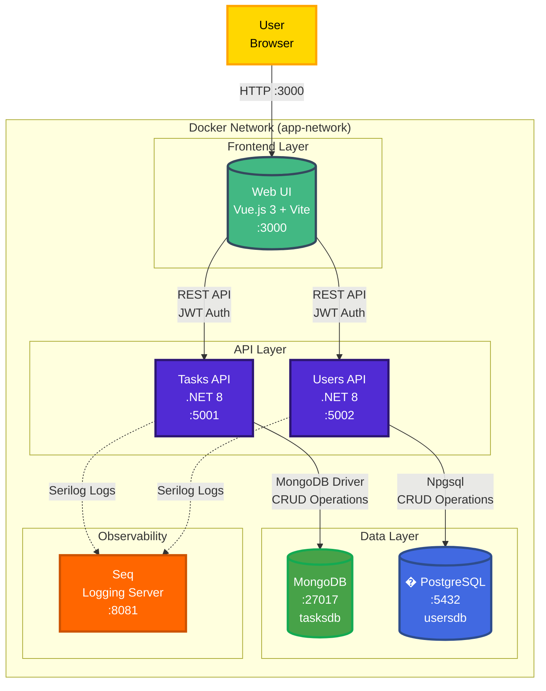

# BLA Task Management System

[](https://dotnet.microsoft.com/)
[](https://vuejs.org/)
[](https://www.mongodb.com/)
[](https://www.postgresql.org/)
[](https://www.docker.com/)

A modern full-stack task management application built with **Clean Architecture**, **TDD**, and **microservices** principles using Docker containerization.

##  Project Overview

This system demonstrates modern software engineering practices:
-  **Clean Architecture** with clear separation of concerns
-  **Test-Driven Development** (TDD) with comprehensive test coverage
-  **Microservices Architecture** with independent services
-  **Docker First** - Full containerization for development and production
-  **Modern Tech Stack** - .NET 8, Vue.js 3, MongoDB, PostgreSQL
-  **RESTful APIs** with OpenAPI/Swagger documentation
-  **JWT Authentication** with role-based access control (RBAC)
-  **Centralized Logging** with Seq for observability

##  System Architecture



### Services

| Service | Technology | Port | Purpose |
|---------|-----------|------|---------|
| **Web UI** | Vue.js 3 + Vite | 3000 | Frontend application |
| **Tasks API** | .NET 8 + MongoDB | 5001 | Task management service |
| **Users API** | .NET 8 + PostgreSQL | 5002 | User authentication & authorization |
| **MongoDB** | MongoDB 7 | 27017 | NoSQL database for tasks |
| **PostgreSQL** | PostgreSQL 16 | 5432 | Relational database for users |
| **Seq** | Datalust Seq | 8081 | Centralized logging and monitoring |

## � Quick Start (Docker)

### Prerequisites

- [Docker Desktop](https://www.docker.com/products/docker-desktop/) installed and running
- [Git](https://git-scm.com/downloads)

### 1. Clone and Start

```bash
# Clone the repository
git clone https://github.com/dkennyq/bla-task-management-system.git
cd bla-task-management-system

# Start all services (first time will build images)
docker compose up -d

# Check service status
docker compose ps

# View logs (optional)
docker compose logs -f
```

### 2. Access the Application

Once all containers are running:

| Service | URL | Description |
|---------|-----|-------------|
|  **Web Application** | http://localhost:3000 | Main UI |
|  **Tasks API Swagger** | http://localhost:5001/swagger | Tasks API documentation |
|  **Users API Swagger** | http://localhost:5002/swagger | Users API documentation |
|  **Seq Logs** | http://localhost:8081 | Centralized logging dashboard |

### 3. Login Credentials

The system comes with pre-seeded users:

| Email | Password | Role | Access Level |
|-------|----------|------|--------------|
| `admin@taskmanagement.com` | `Password123!` | Manager | Full access + user management |
| `manager@taskmanagement.com` | `Password123!` | Manager | Full task access |
| `operator@taskmanagement.com` | `Password123!` | Operator | Limited task access |

### 4. Stop Services

```bash
# Stop services (keeps data)
docker compose down

# Stop services and remove data volumes (fresh start)
docker compose down -v
```

##  Documentation

-  **[Development Process](DEVELOPMENT_PROCESS.md)** - 🎯 **Thought process, AI-assisted approach, and methodology**
-  **[Setup Guide](docs/SETUP.md)** - Detailed installation and configuration
-  **[API Testing Guide](docs/TESTING_APIS.md)** - How to test APIs with Postman, Swagger, curl
-  **[API Security Guide](docs/API_SECURITY_GUIDE.md)** - Authentication and authorization
-  **[Logging Guide](docs/LOGGING_GUIDE.md)** - Structured logging with Serilog and Seq
-  **[User Stories](docs/USER_STORIES.md)** - Product requirements and features
-  **[Frontend README](apps/web/README.md)** - Vue.js application details

##  Project Structure

```
bla-task-management-system/
 apps/
    tasks-api/              # Task Management Microservice
│       src/
          TasksApi.Domain/         # Business entities
          TasksApi.Application/    # Use cases and business logic
          TasksApi.Infrastructure/ # Data access (MongoDB)
          TasksApi.WebApi/         # REST API endpoints
       tests/                        # Unit and integration tests
   
    users-api/              # User Management Microservice
       src/
          UsersApi.Domain/         # Business entities
          UsersApi.Application/    # Use cases and business logic
          UsersApi.Infrastructure/ # Data access (PostgreSQL)
          UsersApi.WebApi/         # REST API endpoints
       tests/                        # Unit and integration tests
│   
    web/                    # Vue.js Frontend
        src/
           components/     # Reusable Vue components
           views/          # Page components
           stores/         # Pinia state management
           services/       # API client services
           router/         # Vue Router configuration
        tests/              # Vitest unit tests

 infrastructure/
    docker/                 # Dockerfiles for each service
    database/               # Database initialization scripts
        mongodb/            # MongoDB seed data
        postgres/           # PostgreSQL schema and seed data

 docs/                       # Documentation
 scripts/                    # Utility scripts
 docker-compose.yml          # Docker orchestration
 .github/                    # GitHub Actions CI/CD
```

##  Testing

### Run Tests in Docker

```bash
# Backend tests
docker compose exec tasks-api dotnet test
docker compose exec users-api dotnet test

# Frontend tests
docker compose exec web npm run test:unit
```

### Test Coverage

All services include comprehensive test suites:
- **Unit Tests** - Domain logic and business rules
- **Integration Tests** - Database operations and API endpoints
- **Component Tests** - Vue.js components (frontend)

See [TESTING_APIS.md](docs/TESTING_APIS.md) for detailed API testing instructions.

##  Development

### Local Development Setup

For local development without Docker (optional):

See [SETUP.md](docs/SETUP.md) for detailed instructions on:
- Installing .NET 8 SDK, Node.js, MongoDB, PostgreSQL
- Running services individually
- Database configuration
- Troubleshooting

### Environment Variables

The frontend uses environment variables for API configuration:

```env
# Docker environment (default)
VITE_TASKS_API_URL=http://localhost:5001/api
VITE_USERS_API_URL=http://localhost:5002/api

# Local development (Visual Studio)
VITE_TASKS_API_URL=https://localhost:7071/api
VITE_USERS_API_URL=https://localhost:7070/api
```

See `apps/web/.env.example` for complete configuration options.

##  Security

- **JWT Authentication** - Secure token-based authentication
- **Role-Based Access Control (RBAC)** - Manager, Operator roles
- **Password Hashing** - BCrypt for secure password storage
- **CORS Configuration** - Controlled cross-origin access
- **Environment Variables** - Secrets managed via .env files

 **Production Note:** Change default JWT secrets and database credentials before deploying to production!

##  Docker Details

### Volume Persistence

Docker volumes ensure data persists between container restarts:

- `mongo-data` - MongoDB database files
- `postgres-data` - PostgreSQL database files
- `seq-data` - Seq logging data

To start fresh with seed data only:
```bash
docker compose down -v  # Remove volumes
docker compose up -d    # Recreate with seed data
```

### Rebuild Images

After code changes:
```bash
# Rebuild specific service
docker compose build web
docker compose up -d web

# Rebuild all services
docker compose build
docker compose up -d
```

##  Features

### Tasks Management
-  Create, read, update, delete tasks
-  Task status tracking (Pending, In Progress, Completed)
-  Priority levels (Low, Medium, High)
-  Due dates and timestamps
-  User-specific task filtering

### User Management
-  User registration and authentication
-  JWT token-based sessions
-  Role-based access control
-  Admin user management panel
-  Password reset functionality

### Technical Features
-  RESTful API design
-  OpenAPI/Swagger documentation
-  Structured logging with Serilog + Seq
-  Health checks for all services
-  Docker Compose orchestration
-  Responsive UI with TailwindCSS

##  Monitoring & Logging

### Seq Logging Dashboard

Access Seq at http://localhost:8081 to:
- View real-time logs from all services
- Filter and search log events
- Monitor API performance
- Track errors and exceptions
- Query structured log data

See [LOGGING_GUIDE.md](docs/LOGGING_GUIDE.md) for details on logging implementation.

##  Contributing

This is a technical interview exercise project. For questions or suggestions:
- Open an issue on GitHub
- Submit a pull request
- Contact the maintainer

##  License

This project is created for educational and interview purposes.

##  Links

- **GitHub Repository:** https://github.com/dkennyq/bla-task-management-system
- **Issue Tracker:** https://github.com/dkennyq/bla-task-management-system/issues
- **Pull Requests:** https://github.com/dkennyq/bla-task-management-system/pulls

---

**Made with  using .NET 8, Vue.js 3, and Docker**
